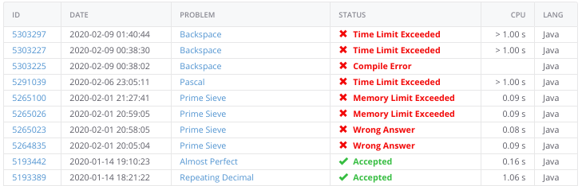

## A list of my favorite problems I've done on Kattis (using Java/Go)

List of all 42 problems I've completed:  
<https://gitlab.com/Rairden/kattis/-/tree/master/src>

| My src code                                                                                                                   | Difficulty | Problem                                                                         |
|-------------------------------------------------------------------------------------------------------------------------------|-----------:|---------------------------------------------------------------------------------|
| [phonelist](https://gitlab.com/Rairden/kattis/-/blob/master/src/phonelist/PhoneList.java)                                     |        4.4 | [phonelist](https://open.kattis.com/problems/phonelist)                         |
| [almostPerfect](https://gitlab.com/Rairden/kattis/-/blob/master/src/almostperfect/AlmostPerfect.java)                         |        3.7 | [almostPerfect](https://open.kattis.com/problems/almostperfect)                 |
| [grid](https://gitlab.com/Rairden/kattis/-/blob/master/src/grid/Grid.java)                                                    |        3.0 | [grid](https://open.kattis.com/problems/grid)                                   |
| [roundedButtons](https://gitlab.com/Rairden/kattis/-/blob/master/src/roundedbuttons/RoundedButtons.java)                      |        3.0 | [roundedButtons](https://open.kattis.com/problems/roundedbuttons)               |
| [conversationLog](https://gitlab.com/Rairden/kattis/-/blob/master/src/conversationlog/ConversationLog.java)                   |        2.9 | [conversationLog](https://open.kattis.com/problems/conversationlog)             |
| [backspace](https://gitlab.com/Rairden/kattis/-/blob/master/src/backspace/Backspace.java)                                     |        2.9 | [backspace](https://open.kattis.com/problems/backspace)                         |
| [guessTheDataStructure](https://gitlab.com/Rairden/kattis/-/blob/master/src/guessthedatastructure/GuessTheDataStructure.java) |        2.7 | [guessTheDataStructure](https://open.kattis.com/problems/guessthedatastructure) |
| [simplicity](https://gitlab.com/Rairden/kattis/-/blob/master/src/simplicity/Simplicity.java)                                  |        2.6 | [simplicity](https://open.kattis.com/problems/simplicity)                       |
| [crackingRSA](https://gitlab.com/Rairden/kattis/-/blob/master/src/crackingrsa/CrackingRSA.java)                               |        2.4 | [crackingRSA](https://open.kattis.com/problems/crackingrsa)                     |
| [iRepeatMyself](https://gitlab.com/Rairden/kattis/-/blob/master/src/irepeatmyself/IRepeatMyself.java)                         |        2.4 | [iRepeatMyself](https://open.kattis.com/problems/irepeatmyself)                 |
| [veci](https://gitlab.com/Rairden/kattis/-/tree/master/src/veci)                                                              |        1.8 | [veci](https://open.kattis.com/problems/veci)                                   |
| [keyToCrypto](https://gitlab.com/Rairden/kattis/-/blob/master/src/keytocrypto/KeyToCrypto.java)                               |        1.7 | [keyToCrypto](https://open.kattis.com/problems/keytocrypto)                     |
| [weakVertices](https://gitlab.com/Rairden/kattis/-/tree/master/src/weakvertices)                                              |        1.6 | [weakVertices](https://open.kattis.com/problems/weakvertices)                   |

I started doing these in May 2019. I imagine I completed the majority (20/42) of them in 2 months.

* I solved them all without cheating
* Each problem took roughly 2 - 4 hrs to solve

The two I'm most proud of are `grid` and `phonelist`.

I really enjoyed solving the encryption ones too (crackingrsa, keytocrypto). They were really hard!

When I first started, my problem-solving peaked out around 1.8 difficulty. Now I can get to 3.0 is my new ceiling. Anything higher requires a math book or graphs (which I have no experience).

## Took a 2-3 month break

**School semester starting back up (SP 2020). Time to practice some more programming**

As of February 2020, I've started trying harder ones (3.8, 3.9, 4.8).  I did solve them, but it fails on `Time Limit Exceeded` or `Memory Limit Exceeded`.  So I've done 2 now and I'm not used to being unable to beat the time limit (I always can after refactoring for 1-2 days).

| My src code                                                                                | Difficulty | Issue |
| ------------------------------------------------------------------------------------------ | ---------: | ----: |
| [primeSieve](https://gitlab.com/Rairden/kattis/-/blob/master/src/primesieve/primesieve.go) | {- 4.8 -}  | time  |
| [pascal](https://gitlab.com/Rairden/kattis/-/blob/master/src/pascal/Pascal.java)           | {- 3.9 -}  | time  |
| [backspace](https://gitlab.com/Rairden/kattis/-/blob/master/src/backspace/backspace.go)    | {+ 2.9 +}  | time  |
