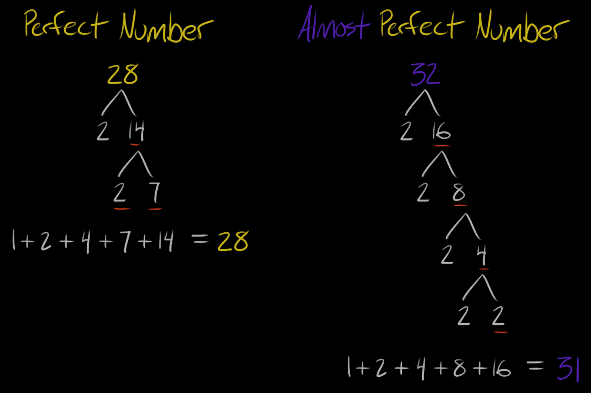

# Perfect Number

<https://open.kattis.com/problems/almostperfect>

## I could not get java code to pass the 1 second time limit.

I ended up getting 0.16 sec on kattis. The hard part is writing fast code to find the `almost perfect` numbers.  



Here is code I originally wrote, which tries to find every single divisor of an integer. So if p = 900,000,000 then you will iterate over it that many times. You can get that number down to 30,000 if you realize divisors are duplicated past the midpoint and take the root $`\sqrt{900,000,000}`$ = 30,000.

## Before - time limit exceeded

```java
static int sumAllDivisors(int p) {
    int sum = 1;
    for (int i = 2; i < p; i++) {
        if (p % i == 0) {
            sum += i;
        }
    }
    return sum;
}
```

## After - passes Kattis in 0.17 sec

I only tweaked `sumAllDivisors(int)`.

```java
static String calcPerfectNumber(int p) {
    int sum = sumAllDivisors(p);
    if (sum == p) {
        return "perfect";
    }
    return sum >= p-2 && sum <= p+2 ? "almost perfect" : "not perfect";
}

static int sumAllDivisors(int p) {
    int sum = 1;
    for (int i = 2; i <= Math.sqrt(p); i++) {
        if (p % i == 0) {
            if (p / i == i) {
                sum += i;
            } else {
                sum += i;
                sum = sum + (p / i);
            }
        }
    }
    return sum;
}
```

## Best - passes Kattis in 0.16 sec

This is a cheater technique. I don't need the method `sumAllDivisors(int)` anymore.

```java
static String calcPerfectNumber(int p) {
    // list of perfect numbers below 1 billion
    if (p == 6 || p == 28 || p == 496 || p == 8128 || p == 33550336) {
        return "perfect";
    }
    if (almostPerfect.contains(p)) {
        return "almost perfect";
    }
    return "not perfect";
}

static List<Integer> almostPerfect = new ArrayList<>(Arrays.asList(2, 3, 4, 8, 10, 16, 20, 32, 64, 104, 
        128, 136, 256, 464, 512, 650, 1024, 1952, 2048, 4096, 8192, 16384, 32768, 32896, 65536, 130304, 
        131072, 262144, 522752, 524288, 1048576, 2097152, 4194304, 8382464, 8388608, 16777216, 33554432, 
        67108864, 134193152, 134217728, 268435456, 536870912));
```

To find the above list of `almost perfect` numbers took 3+ hours (didn't finish) on 10 threads on the first bad method.  
I tweaked it with the square root loop. Using 10 threads took 1-2 hours while I was sleeping.  

## Test on my hardware (worst case inputs) - large inputs
So I imagine using this cheater lookup list should be faster. So let's get a bigger `n` value. Kattis only uses `n` = 500 for the number of inputs.  
I compare both snippets of code above using a large number of inputs `n` = 10,042 and 100,042.

not using `lookup List` with n = 10,042 plus all 42 _almost perfect_ numbers.  Range: 900,000,000 - 900,009,999
* 775 ms

using the `lookup List` with n = 10,042. This is 17x faster than above doing it manually.
* 45 ms

## Now grow input size from 10,000 to 100,000
not using `lookup List` with n = 100,042 plus all 42 _almost perfect_ numbers. Range: 999,900,001 - 1,000,000,000
* 7325 ms

using the `lookup List` with n = 100,042.  This is 53x faster than above doing it manually.
* 138 ms

# Conclusion

## The lookup List helps a lot for large inputs
For input sizes of 500 or 10,000, it doesn't really make a huge difference.  
Although if `n` = 100,000 then it makes an enormous difference.
