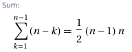

# Phone List
## https://open.kattis.com/problems/phonelist

### I could not get java code to pass the 3 second time limit.  
A naive algo I wrote is very slow, which has a time complexity of &Omicron;(n&sup2;). And within it calls `String.indexOf()`.  
The summation for the naive algo listed below is .


## Before - time limit exceeded

```java
for (int i = 0; i < phoneNumbers; i++) {
    int iLength = numbers[i].length();

    for (int k = i + 1; k < phoneNumbers; k++) {
        if (numbers[i].charAt(0) != numbers[k].charAt(0)) continue;
        int kLength = numbers[k].length();
        if (iLength == kLength) continue;

        if (iLength < kLength) {
            if (numbers[k].indexOf(numbers[i]) == 0) return "NO";
        } else if (numbers[i].indexOf(numbers[k]) == 0) return "NO";
    }
}
return "YES";
```

I made a test file that has 20 test cases. Each case has `10,000` numbers for a total of 200,000 phone numbers. Each number of length 8-10.  
This code takes my machine `3464 ms` to finish.

Here is the benchmark of the different techniques.

| algo                      | runtime (ms) |
|---------------------------|-------------:|
| Princeton's TrieST        |          207 |
| my naive String.indexOf() |        3,464 |
| KMP (princeton)           |        6,767 |
| BoyerMoore (princeton)    |        9,094 |
| BoyerMoore (github)       |       10,981 |
| BoyerMoore (dartmouth)    |       13,972 |

On all of those except the first one I used a nested O(n&sup2;) loop.

The runtime when using a Trie is incredible, since there's no nested loop.  
Using a nested loop means the code block executes (n&sup2; - n)/2. Which is (10,000&sup2; x 9,999&sup2;)/2 = 49,995,000. Then it hits `String.indexOf()` or `KMP`.

A trie only needs to iterate over `n`, which is 10,000 phone numbers. And for each phone number, it traverses the trie, which has a max depth of 10.

Princeton has some nice libraries. Here is the [TrieST class](https://algs4.cs.princeton.edu/code/edu/princeton/cs/algs4/TrieST.java.html) on their site. I do not like how they use their own `StdIn` & `StdOut` class among others for all their files. I remove that. I also remove their own `Queue` class (87 lines) which is implemented w/ a linked list.

I modified their `TrieST` class since I don't like the Queue dependency they use (87 lines). I use Java's collections to keep it simple (ArrayBlockingQueue). The runtime was the same.

```diff
-        Queue<String> results = new Queue<String>();
+        Queue<String> results = new ArrayBlockingQueue<>(10);

-        if (x.val != null) results.enqueue(prefix.toString());
+        if (x.val != null) results.add(prefix.toString());

-        Queue<String> results = new Queue<String>();
+        Queue<String> results = new ArrayBlockingQueue<>(10);

-            results.enqueue(prefix.toString());
+            results.add(prefix.toString());
```

