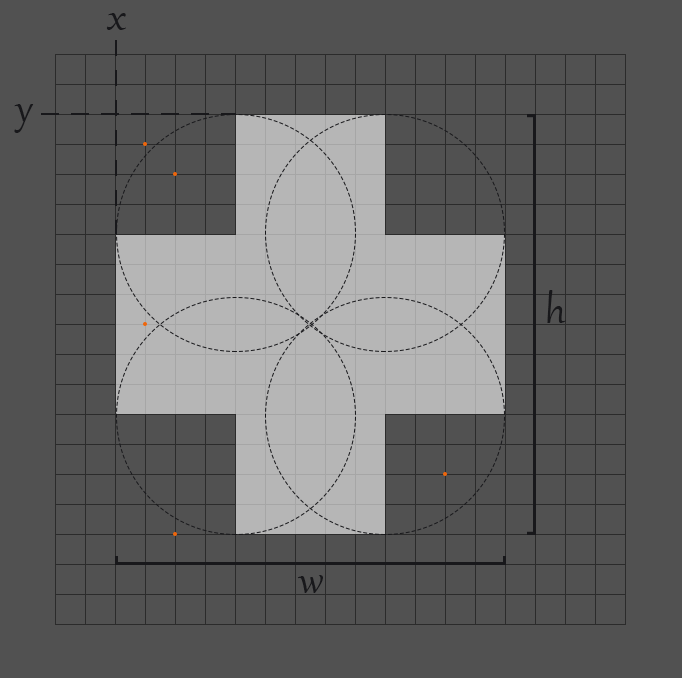
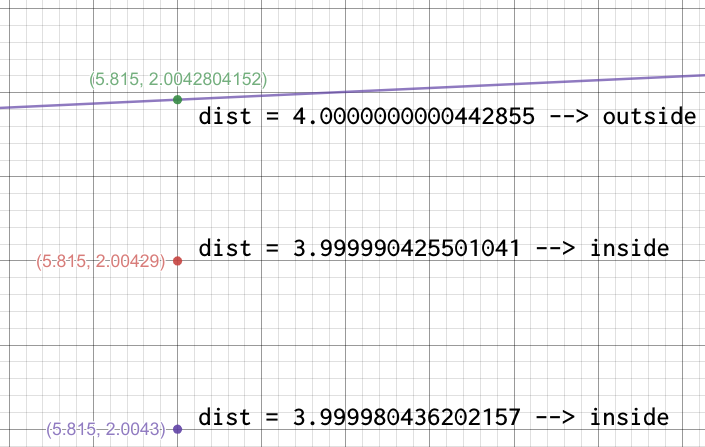

Most styles of graphical user interface make use of lots of rectangles. Buttons are rectangular, menus are rectangular and windows are rectangular. 
Some styles of user interface exhibit a softer appearance by using rounded rectangles for some components. 
As illustrated below, a rounded rectangle replaces the sharp corners of an ordinary rectangle with a smooth quarter circles.

Using a coordinate system with the X axis pointing to the right and the Y axis pointing down, a rounded rectangle is described by giving the `x,y` locations of the left and top edges. 
The width, `w`, describes the distance between the left and right edges, and the height, `h`, describes the distance between the top and the bottom edges. 
The radius used for the quarter-circle rounded corners is given by the `r` parameter.

## Input
Input begins with a line containing an integer 1 ≤ n ≤ 100. The next n lines each contain one test case. 
A test case has a rounded rectangle description and mouse click locations. 
The rectangle is given by 5 real numbers for the parameters `x y w h` and `r`. These parameters always describe a legal rounded rectangle. 
In particular, it is guaranteed that 0 ≤ `x,y` ≤ 1000, 0 < `w,h` ≤ 1000, and 0 ≤ 2r ≤ min(`w,h`). 
After the rectangle description is an integer 0 ≤ m ≤ 1000. Following this on the same line are `m` pairs of real numbers, each pair representing the `x` and `y` coordinates of a mouse click. 
All mouse clicks are in the range 0 ≤ `x,y` ≤ 2000. All real numbers given as input have at most 3 digits after the decimal point.

## Output
For each mouse click location, output inside if the location is inside the rounded rectangle, or outside otherwise. A mouse click right on the edge of a rounded rectangle should be classified as inside.

`Sample Input/Output`

<pre>
3
1 8 14 13 3 5 8 6 15 8 12 11 14 21 2.5 20
2 2 13 14 4 5 4 4 4 16 13 14 3 3 3 9
85.7 114.7 3.2 6.0 1.2 3 86.3 114.8 88.1 118.2 85.9 120.7
</pre>
<pre>
outside
outside
inside
outside
inside

inside
outside
inside
outside
inside

outside
inside
outside
</pre>