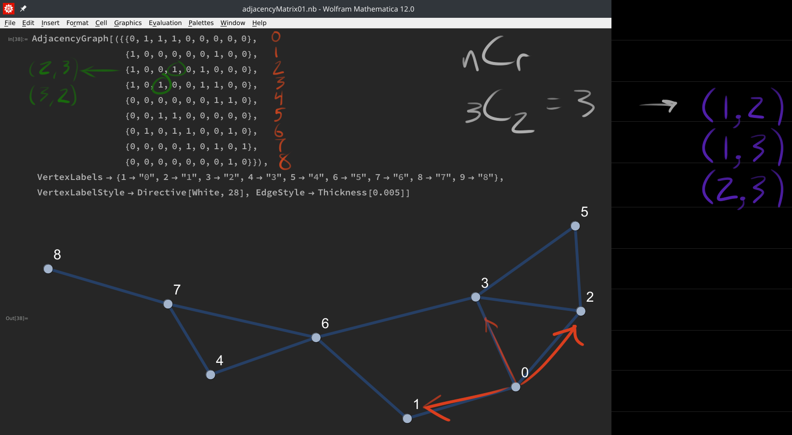

# Weak Vertices

<https://open.kattis.com/problems/weakvertices>

Engineers like to use triangles. It probably has something to do with how a triangle can provide a lot of structural strength. 
We can describe the physical structure of some designs using an undirected graph. We’ll say vertex `i` is part of a triangle if `i` 
has two different neighbors `j` and `k` such that `j` and `k` are neighbors of each other. For this problem, find weak vertices 
in graphs – those vertices that is not part of any triangle.

**Figure 1**: An illustration of the weak vertices (which are shaded) from the sample input graph.

## Input

Input consists of up to 100 graphs. Each starts with an integer, 1 ≤ n ≤ 20, giving the number of vertices in the graph. 
Next come n lines with n integers on each line, which describe an n x n adjacency matrix for the graph. 
Vertices are numbered from 0 to n − 1. If the adjacency matrix contains a one at row r, column c (where 0 ≤ r, c ≤ n − 1), 
it means that there is an edge from vertex r to vertex c. Since the graph is undirected, the adjacency matrix is symmetric. 
The end of input is marked by a value of −1 for n.

## Output

For each graph, produce a line listing the weak vertices ordered from least to greatest.

`Sample Input/Output`

<pre>
9
0 1 1 1 0 0 0 0 0
1 0 0 0 0 0 1 0 0
1 0 0 1 0 1 0 0 0
1 0 1 0 0 1 1 0 0
0 0 0 0 0 0 1 1 0
0 0 1 1 0 0 0 0 0
0 1 0 1 1 0 0 1 0
0 0 0 0 1 0 1 0 1
0 0 0 0 0 0 0 1 0
1
0
-1
</pre>
<pre>
1 8
0
</pre>
